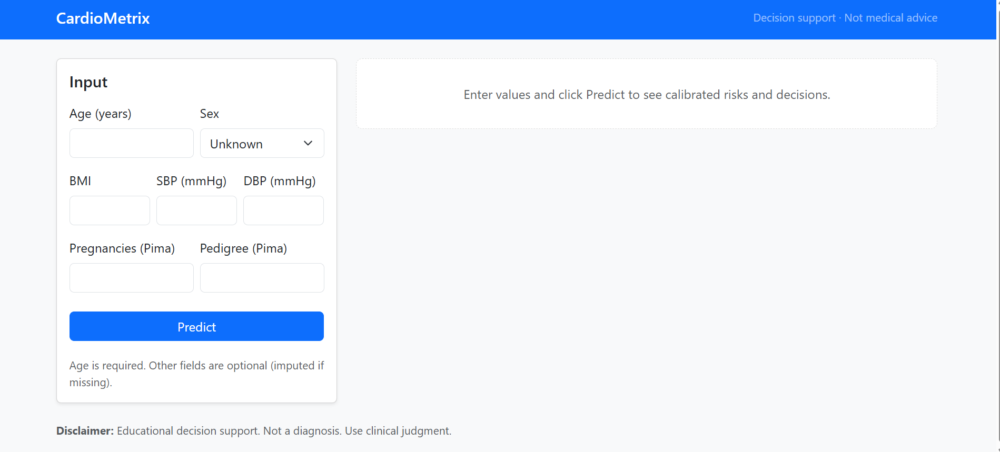
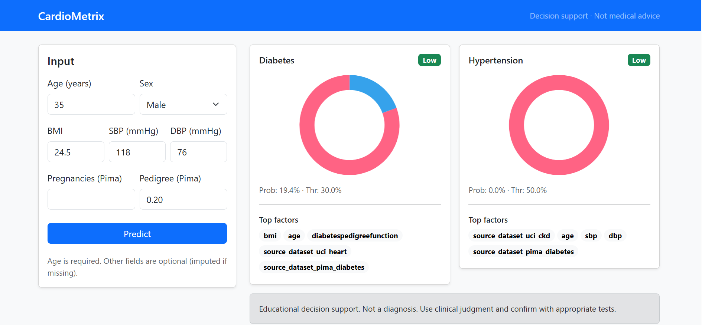
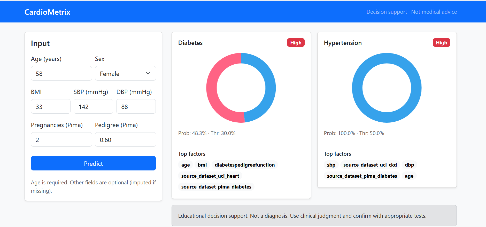

# CardioMetrix

**Calibrated XGBoost screening for Diabetes & Hypertension** — with fairness checks and a polished Flask + Bootstrap dashboard.



> **Disclaimer**  
> This project is for **educational decision support** only. It is **not** a medical device and **not** a diagnosis. Always use clinical judgment and confirm with appropriate tests.

---


## Motivation

Preventive care wins when it’s **early, explainable, and responsible**. CardioMetrix is a compact, end-to-end pipeline that:

- Trains **tabular-first models** (XGBoost) for **diabetes** and **hypertension** screening.  
- Ships **calibrated probabilities** and **transparent decisions** (threshold policy).  
- Surfaces **patient-level explanations** (SHAP) and **fairness slices** (sex/age).  
- Provides a clean **Flask API** and a **Bootstrap dashboard** for demo or offline use.

This repo is resume-ready and production-minded: data is harmonized, labels are documented, splits are persisted, artifacts are versioned, and UI is polished.

---

## Features

- 🧠 **Primary model**: **XGBoost** for tabular data; **Logistic Regression** as a baseline reference.  
- 🧼 **Leakage-aware features**:  
  - Diabetes model **excludes fasting glucose** (kept only for labeling).  
  - Hypertension model may use **SBP/DBP** (clinical signal).  
- 🎯 **Calibration**: Isotonic calibration on the validation set; decision thresholds chosen on validation.  
- ⚖️ **Fairness**: Slice metrics by **sex** and **age bands**; optional per-sex thresholds with a recall floor.  
- 🔎 **Explainability**: SHAP (TreeExplainer) top factors per prediction.  
- 📦 **Artifacts**: Preprocessors, models, calibrators, thresholds saved to `registry/` for serving.  
- 🖥️ **Dashboard**: Flask + Bootstrap + Chart.js donuts, with error handling and input validation.

---

## Live Demo Screenshots

**Dashboard**  


**Male example (expected low risk)**  


**Female example (expected higher risk)**  



Suggested test inputs for those screenshots:

- **Male (low risk)**: Age 35, Sex Male, BMI 24.5, SBP 118, DBP 76, Pedigree 0.20  
- **Female (higher risk)**: Age 58, Sex Female, BMI 33.0, SBP 142, DBP 88, Pregnancies 2, Pedigree 0.60

---

## Project Structure

```text
.venv/                     # Python virtual environment
cardiometrix/
├─ app/
│  ├─ app_flask.py           # Flask server (API + dashboard routes)
│  ├─ predictor.py           # Loads artifacts, validates inputs, predicts, SHAP top factors
│  ├─ templates/
│  │  ├─ base.html
│  │  └─ index.html          # Dashboard UI
│  └─ static/
│     ├─ css/app.css
│     └─ js/app.js
├─ data/
│  ├─ raw/                   # Downloaded CSVs (Pima, UCI Heart, CKD)
│  └─ processed/
│     ├─ harmonized.csv
│     └─ harmonized_labeled{__train,__val,__test}.csv
├─ docs/
│  ├─ PRD.md                 # Product Requirements (objectives, metrics, ethics)
│  ├─ DATA_DICTIONARY.csv
│  ├─ LABEL_POLICY.md
│  └─ SPLIT_STRATEGY.md
├─ indices/
│  ├─ train_idx.csv
│  ├─ val_idx.csv
│  └─ test_idx.csv
├─ notebooks/                # Training pipeline (Week 1–2)
├─ registry/                 # Production artifacts (for serving)
│  ├─ prod_preprocessor__{diabetes,hypertension}.joblib
│  ├─ prod_xgb__{diabetes,hypertension}.joblib
│  ├─ prod_calibrator__{diabetes,hypertension}.joblib
│  ├─ prod_thresholds.json
│  └─ feature_spec_per_target.joblib
cardiometrix.ipynb         # Training notebook (Week 1–2)
README.md
```
---


# 📊 Health Risk Prediction Models

## Data Sources & Harmonization

### Sources (de-identified public tabular)
- **Pima Indians Diabetes (Pima)** → `diabetes.csv`  
- **UCI Heart Disease (Heart)** → `heart.csv`  
- **Chronic Kidney Disease (CKD)** → `ckd.csv`

### Harmonization Pipeline
- Map raw fields into a unified schema: `age`, `sex`, `bmi`, `sbp`, `dbp`, `tc`, ...  
- Keep dataset-specific attributes under `extra__*`  
  - e.g., `extra__pregnancies`, `extra__diabetespedigreefunction`, `extra__htn`  
- Apply conservative physiological bounds (**out-of-range → NaN**).  
- Add numeric missingness indicators for auditability.  
- Persist a single table: `data/processed/harmonized.csv`.  

⚠️ Note: Some features (e.g., **HDL/LDL/TG/HbA1c/eGFR**) are **100% missing** in these public datasets, but remain in the schema for future compatibility. They are **not used** by the current models.

---

## Label Policy
📄 Documented in `docs/LABEL_POLICY.md`. Summary:

### Diabetes (`label_diabetes`)
- **1 if any of:**
  - HbA1c ≥ 6.5  
  - Fasting_glucose ≥ 126  
  - Dataset diagnosis flag  
- We **explicitly do not use fasting glucose as a feature** for the diabetes model (to avoid leakage).

### Hypertension (`label_hypertension`)
- **1 if any of:**
  - SBP ≥ 140  
  - DBP ≥ 90  
  - CKD htn flag  

### ASCVD Proxy
- Lightweight educational risk proxy from **age / sbp / tc / hdl**  
- *(not a clinical calculator)*

---

## Data Splits
- **70/15/15 (train/val/test)**, stratified by joint label (`"00","01","10","11"`)  
- Indices persisted to `indices/`

---

## Modeling Choices
- **Tabular-first** → XGBoost primary (tree ensembles handle missingness well).  
- **Baseline** → Logistic Regression for transparent reference.  
- **Leakage-aware** → Diabetes model excludes fasting glucose & label-like columns.  
- **Calibration** → Isotonic regression on validation outputs.  
- **Thresholds** → Validation F1 maximisation:  
  - Diabetes: **0.20**  
  - Hypertension: **0.35**  

📉 Tradeoffs:  
- Lower thresholds ↑ recall ↓ precision.  
- Adjustable in `registry/prod_thresholds.json`.

### Artifacts Saved in `registry/`
- `prod_preprocessor__{diabetes,hypertension}.joblib`  
- `prod_xgb__{diabetes,hypertension}.joblib`  
- `prod_calibrator__{diabetes,hypertension}.joblib`  
- `prod_thresholds.json`  
- `feature_spec_per_target.joblib`  

---

## Training & Evaluation

### Chosen Thresholds (Validation)
- **Diabetes** → 0.20 (F1 ≈ 0.688)  
- **Hypertension** → 0.35 (F1 ≈ 0.804)  

### Test Metrics
#### Diabetes (risk-factor model; glucose excluded)
- Accuracy: **0.679**  
- Positive-class F1: **0.660**  
- Precision: **0.535**  
- Recall: **0.863**  
- *Screening-leaning: higher recall by design.*

#### Hypertension
- Accuracy: **0.905**  
- Positive-class F1: **0.774**  
- Precision: **0.750**  
- Recall: **0.800**  
- *Signal primarily driven by SBP/DBP + age.*

⚠️ **OOD Note**: Datasets are adult populations; pediatric inputs are out-of-distribution.

---

## Fairness & Responsible AI

### Slices
- Evaluate precision/recall/F1 by:  
  - **Sex** → (F / M / Unknown)  
  - **Age bands** → (≤30, 31–45, 46–60, 60+)  

### Policy
- Optional **per-sex thresholds** for diabetes with a recall floor.  
- Falls back to the **global threshold** for small slices.  

### Governance
- Ethics/guardrails captured in `docs/PRD.md`.  
- Reinforced in UI disclaimer.  

⚠️ **Important**:  
In production deployments, always pair these models with **clinical oversight** and **local policy review**.


